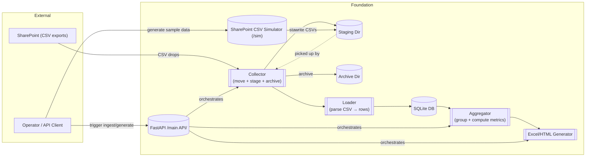

# Charlie Reporting (Lean Foundation Restart)

[](https://github.com/jwardwell7077/charlie-reporting/actions/workflows/quality-gate.yml)

This repository has been reset to a **minimal, configurable reporting foundation** focused on:

* Ingesting SharePoint‑exported CSV drops
* Loading data into a lightweight local SQLite store
* Generating hourly and quad‑daily Excel/HTML outputs
* Preparing for later email distribution & real SharePoint / Graph API integration

Historic microservice code has been pruned (kept in prior Git history). Documentation & configuration files remain for reference/value.

## Current Core

```text
foundation/
 README.md              # Detailed foundation architecture
 pyproject.toml         # Isolated tooling + deps (FastAPI, pandas, etc.)
 src/
  config/settings.py   # TOML settings loader (schedules, sources, columns)
  pipeline/            # collector | loader | aggregator | excel
  services/            # sharepoint_stub.py | api.py (FastAPI)
 tests/
  test_settings.py
config/
 settings.toml          # Active foundation configuration (new)
 config.toml            # Legacy (phase 2) email + attachment config (retained)
data/ (sample CSVs kept)
docs/ (original documentation preserved)
```

* Lightweight SharePoint CSV simulator (deterministic test data generator) under `sharepoint_sim` with FastAPI endpoints mounted at `/sim`:

## SharePoint CSV Simulator Testing

All dataset generators are covered by property-based tests (using Hypothesis) that verify:

* Header and schema invariants
* Role enforcement
* Value ranges and edge cases
* Row count clamping

Edge-case and regression tests are included for all error branches and invariants. See `tests/sim/` for details.

## SharePoint CSV Simulator Usage

The simulator is mounted at `/sim` in the main API. Example endpoints:

* `POST /sim/generate?types=ACQ,Productivity&rows=25` — generate one or more datasets
* `GET /sim/files` — list generated files
* `GET /sim/download/{filename}` — download CSV
* `POST /sim/reset` — clear generated files

Simulator configuration: edit `config/sharepoint_sim.toml`:

```toml
# config/sharepoint_sim.toml
seed = 12345  # (optional) for deterministic output; omit for random
output_dir = "sharepoint_sim"  # where generated CSVs are written
timezone = "UTC"  # currently only UTC supported
```

Files are named `<DATASET>__YYYY-MM-DD_HHMM.csv` (5‑minute UTC rounding) and retained until reset.

## Configuration Overview

Active runtime configuration now lives in `config/settings.toml` (see populated example in repo). Key sections:

* `[schedules]` – hourly interval + explicit quad‑daily times
* `[data_sources]` / `[[data_sources.sources]]` – list of named CSV patterns to ingest
* `[collector]` – input (SharePoint dump), staging, archive directories
* `[report]` – output directory, workbook name, per‑source column whitelists
* `[email]` – (placeholder) future outbound email metadata

Legacy `config/config.toml` provided email folder filters & per‑file column selections. These have been **mapped forward**:

| Legacy Section | New Mapping |
|----------------|-------------|
| `[attachments]` filename → columns | `[report.columns]` source name → columns (source name = lowercased filename stem) |
| `output.excel_dir` | `report.output_dir` |
| `output.archive_dir` | `collector.archive_dir` |
| `directory_scan.scan_path` | `collector.input_root` |

````markdown
# Charlie Reporting (Lean Foundation Restart)

This repository has been reset to a **minimal, configurable reporting foundation** focused on:

* Ingesting SharePoint‑exported CSV drops
* Loading data into a lightweight local SQLite store
* Generating hourly and quad‑daily Excel/HTML outputs
* Preparing for later email distribution & real SharePoint / Graph API integration

Historic microservice code has been pruned (kept in prior Git history). Documentation & configuration files remain for reference/value.

## Branch Strategy

`main-foundation` is the active stabilized branch while foundational refactors settle. Treat it as the integration target (temporary stand‑in for `main`). Merge forward into real `main` once scale/production concerns resume.

## Current Core

```text
foundation/
 README.md              # Detailed foundation architecture
 pyproject.toml         # Tooling + deps
 src/
  config/settings.py   # TOML settings loader
  pipeline/            # collector | loader | aggregator | excel
  services/            # sharepoint_stub.py | api.py
  core/                # hashing, run tracking utilities
 tests/                # characterization + settings tests
config/
 settings.toml          # Active foundation configuration
 config.toml            # Legacy (phase 2) config retained
data/                   # Sample CSVs
docs/                   # Architecture, migration, phase planning
```

## Configuration Overview

Active runtime configuration now lives in `config/settings.toml`.

Key sections: `[schedules]`, `[data_sources]` / `[[data_sources.sources]]`, `[collector]`, `[report]`, `[email]` (placeholder).

Legacy to new mapping (selected): `output.excel_dir` → `report.output_dir`, `directory_scan.scan_path` → `collector.input_root`, attachment filename columns → `report.columns`.

## Quick Start

```bash
python3 -m venv .venv
source .venv/bin/activate
pip install -r requirements.txt
pip install -e foundation

# Run API (inside venv)
python -m foundation.src.services.api
```

Generate an hourly workbook via API:

```bash
curl -X POST http://localhost:8000/ingest
curl -X POST http://localhost:8000/generate/hourly
```

## Quality Gate & Tooling

Strict gate (local & CI): Ruff (lint/format), mypy (strict), Pyright (strict), pydoclint, interrogate (100% doc coverage), pytest (100% line coverage enforced). Test files are now included in Ruff, mypy, and Pyright runs to keep helper code quality aligned with production modules.

Run locally:
```bash
scripts/quality_gate.sh
```

Pre-commit (`pre-commit install`) runs Ruff, mypy subset, Pyright, quick pytest smoke.

## CI

Workflow `.github/workflows/quality-gate.yml` enforces the gate on pushes / PRs to `main` & `main-foundation`.

## Development Principles

We adhere to a core design principle: **Minimal Entry / Minimal Exit**.

> Each component exposes the fewest necessary public entry points and leaves every object or return value in a fully validated, deterministic state immediately upon exit—no redundant wrapper layers or deferred hidden side effects.

Practical examples:
* `Roster` self-loads on construction (optional `from_csv` classmethod) — removed former `load_roster()` wrapper.
* Dataset generators expose a single `build()` path instead of scattered helper functions.
* Service orchestration keeps state explicit (roster, RNG, storage) with no hidden globals.

See `docs/development_principles.md` for rationale, review checklist, and contribution guidelines.

## Baseline Tag

Tag the stabilized foundation:
```bash
git checkout main-foundation
git tag -a v0.2.0-foundation -m "Foundation quality gate baseline"
git push origin v0.2.0-foundation
```

## Roadmap (Near Term)

1. Expand tests (failure paths, loader idempotency, error cases)
2. Add scheduler (APScheduler) hourly + quad‑daily triggers
3. Implement email packaging (HTML inline + attachment)
4. Extend loader (additional sources, ingestion_log semantics)
5. Structured logging + metrics stub
6. Replace stub with Graph API SharePoint ingestion pipeline

## Contributing / Historical Docs

All prior architecture rationale, migration notes, and phase achievements remain under `docs/`.

## Diagrams

- Architecture Overview (Mermaid): docs/architecture/diagrams/architecture-overview.md
- Service Boundaries (Mermaid): docs/architecture/diagrams/service-boundaries.md
 - Component: Collector — docs/architecture/diagrams/component-collector.md
 - Component: Loader — docs/architecture/diagrams/component-loader.md
 - Component: Aggregator — docs/architecture/diagrams/component-aggregator.md
 - Component: Excel/HTML Generator — docs/architecture/diagrams/component-excel.md
 - Component: API — docs/architecture/diagrams/component-api.md
 - Component: Simulator — docs/architecture/diagrams/component-simulator.md

### Architecture Overview (inline)



## License

Proprietary / internal (adjust as needed). Add explicit license if distribution scope changes.

---
For deeper architectural description see `foundation/README.md`.

````
