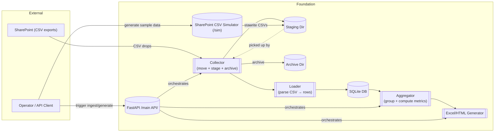

# Architecture Overview

This document provides a high-level view of the foundation architecture and data flow.

Legend:

- External systems on the left; internal components grouped as “Foundation.”
- The API exposes endpoints to generate sample CSVs (via the simulator), trigger ingest, and produce reports.
- The collector moves files from the input root into staging and archive, then the loader parses for storage; aggregation and report generation follow.
