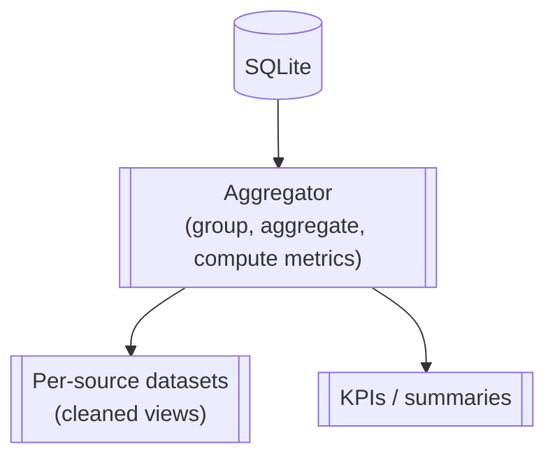

# Component: Aggregator

```mermaid
flowchart TB
  DB[(SQLite)] --> Agg[["Aggregator\n(group, aggregate, compute metrics)"]]
  Agg --> Datasets[["Per‑source datasets\n(cleaned views)"]]
  Agg --> KPIs[["KPIs / summaries"]]
```
