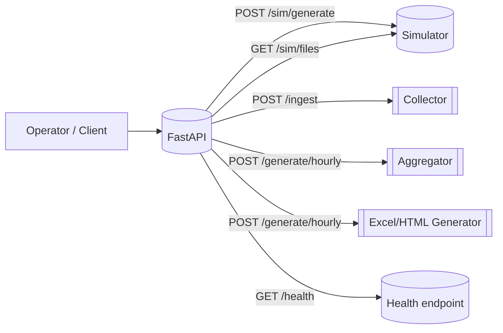

# Component: API (FastAPI)

```mermaid
flowchart LR
  Client["Operator / Client"] --> API[(FastAPI)]

  API -->|POST /sim/generate| Sim[(Simulator)]
  API -->|POST /ingest| Collector[[Collector]]
  API -->|POST /generate/hourly| Aggregator[[Aggregator]]
  API -->|POST /generate/hourly| Excel[[Excel/HTML Generator]]

  API -->|GET /sim/files| Sim
  API -->|GET /health| Health[(Health endpoint)]
```
