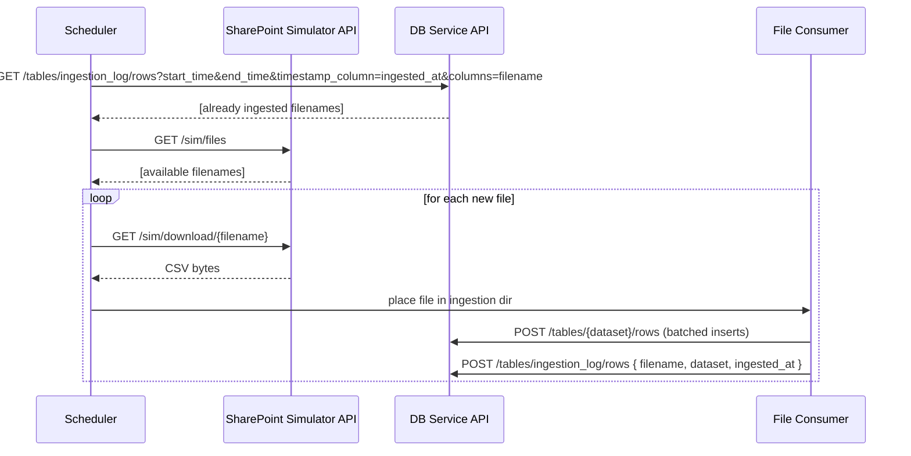

# Component: API (FastAPI)

```mermaid
This repository exposes two FastAPI apps:
- SharePoint Simulator API (test data generation and file listing/download)
- DB Service API (table/row CRUD, CSV ingest, time-window filtering via ISO timestamps)

## Simulator API surface

```mermaid
flowchart LR
  C[Client / Tests] -->|POST /sim/generate| SIM[(Simulator)]
  C -->|GET /sim/spec| SIM
  C -->|GET /sim/files| SIM
  C -->|GET /sim/download/{filename}| SIM
  C -. optional .->|POST /sim/reset| SIM
```

## DB Service API surface

```mermaid
flowchart LR
  C[Client / Scheduler / Consumer / Tests] -->|GET /health| DBAPI[(DB Service API)]
  C -->|POST /tables| DBAPI
  C -->|GET /tables| DBAPI
  C -->|GET /tables/{table}/schema| DBAPI
  C -->|DELETE /tables/{table}| DBAPI
  C -->|POST /tables/{table}/rows| DBAPI
  C -->|GET /tables/{table}/rows?start_time&end_time&timestamp_column&columns| DBAPI
  C -->|DELETE /tables/{table}/rows/{id}| DBAPI
  C -->|PUT /tables/{table}/rows/{id}| DBAPI
  C -->|POST /ingest (CSV or JSON rows)| DBAPI
```

Notes:

- Time-window filtering is lexical on ISO 8601 strings (e.g., 2025-08-20T11:00:00+00:00).
- ingestion_log is a first-class table used by the scheduler to determine already ingested filenames.

## End-to-end API touchpoints



```markdown
````
