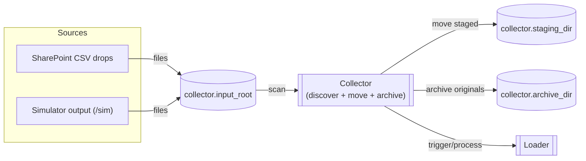

# Component: Collector

```mermaid
flowchart LR
  subgraph Sources
    SP["SharePoint CSV drops"]
    SIM["Simulator output (/sim)"]
  end

  InputRoot[("collector.input_root")]
  Staging[("collector.staging_dir")]
  Archive[("collector.archive_dir")]

  Collector[["Collector\n(discover + move + archive)"]]
  Loader[["Loader"]]

  SP -->|files| InputRoot
  SIM -->|files| InputRoot
  InputRoot -->|scan| Collector
  Collector -->|move staged| Staging
  Collector -->|archive originals| Archive
  Collector -->|trigger/process| Loader
```
