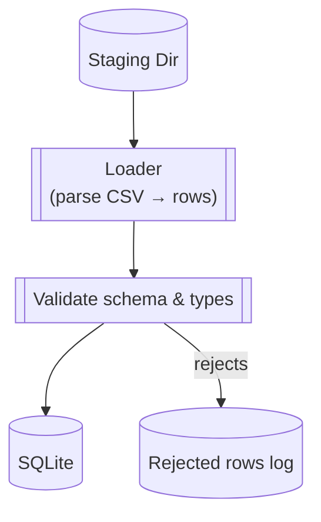

# Component: Loader

```mermaid
flowchart TB
  Staging[(Staging Dir)] --> Loader[["Loader\n(parse CSV → rows)"]]
  Loader --> Valid[[Validate schema & types]]
  Valid --> DB[(SQLite)]
  Valid -->|rejects| Rejected[(Rejected rows log)]
```
