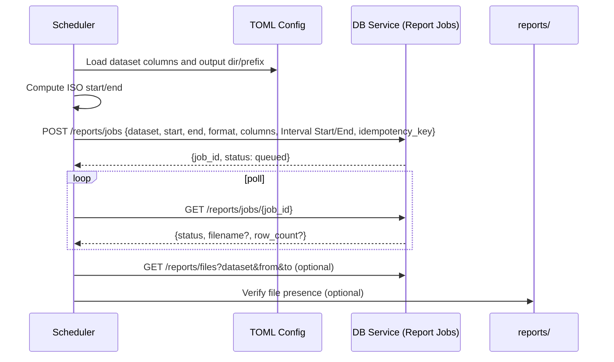
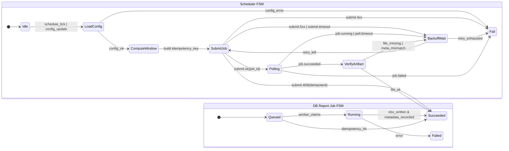

# Report Jobs Architecture

This page visualizes the scheduler-driven Excel report generation using the DB Service.

## component diagram

```mermaid
flowchart LR
  UI[User UI/CLI] --> CFG[(TOML Config)]
  SCH[Scheduler] -->|reads| CFG
  SCH -->|POST /reports/jobs| DBAPI[(DB Service API)]
  SCH -->|GET /reports/jobs/{id}| DBAPI
  DBAPI --> WORKER[Report Worker]
  WORKER -->|write .xlsx| FS[(reports/)]
  SCH -->|verify| DBAPI
```

## sequence diagram



## uml diagram (logical)

```mermaid
classDiagram
  class Scheduler {
    +loadConfig(): Config
    +computeWindow(job): (start,end)
    +submitJob(req): JobId
    +pollUntilComplete(jobId): JobStatus
    +verifyArtifact(JobStatus): bool
  }
  class ReportJobRequest {
    +dataset: str
    +start_time: str
    +end_time: str
    +format: str
    +columns: List~str~
    +interval_start_column: str
    +interval_end_column: str
    +idempotency_key: str
  }
  class DBReportJobsAPI {
    +createJob(ReportJobRequest): JobId
    +getJobStatus(JobId): JobStatus
    +listFiles(filter): List~ReportFile~
    +download(filename): bytes
  }
  class ReportWorker {
    +execute(jobId)
    -fetchRows(req): List~dict~
    -shape(rows, columns): DataFrame
    -writeXlsx(df, path): Path
  }
  class Config {
    +reports: Map~dataset, List~columns~~
    +output: {excel_dir, excel_prefix}
  }
  Scheduler --> DBReportJobsAPI
  Scheduler --> Config
  DBReportJobsAPI --> ReportWorker
  ReportWorker --> Config
```

## fsm diagrams


