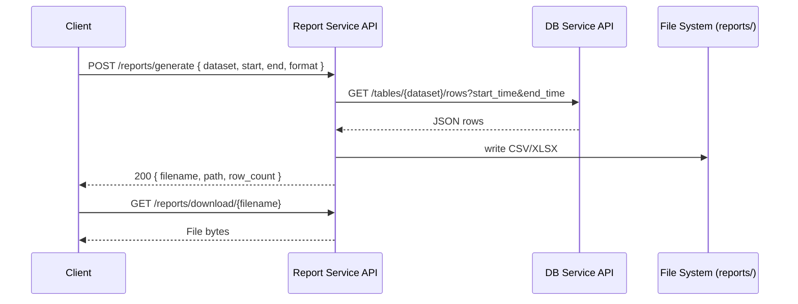

# Component: Report Service

Generates tabular reports (CSV/XLSX) by querying the DB Service API.

```mermaid
flowchart LR
  RS[Report Service API] -->|GET /tables/{dataset}/rows| DB[DB Service API]
  RS -->|writes CSV/XLSX| FS[(reports/)]
  C[Client/Operator] -->|POST /reports/generate| RS
  C -->|GET /reports| RS
  C -->|GET /reports/download/{file}| RS
```


