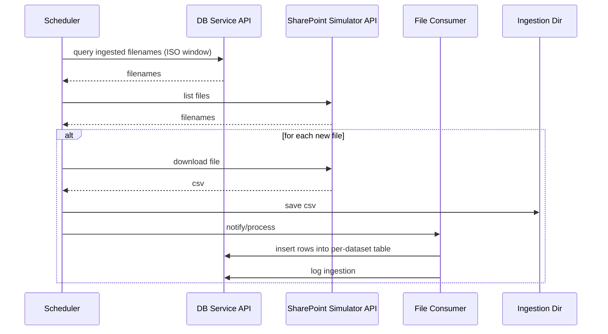

# Component: Scheduler

## Responsibilities

- Poll SharePoint Simulator for available files via HTTP.
- Query DB Service ingestion_log for already ingested filenames in a time window.
- Download only new files to the ingestion directory with retry/backoff.
- Provide optional interval scheduling (APScheduler) and a simple CLI.

## High-level flow

```mermaid
flowchart LR
  S[Scheduler] -->|GET /tables/ingestion_log/rows| DB[(DB Service API)]
  S -->|GET /sim/files| SIM[(SharePoint Simulator API)]
  S -->|GET /sim/download/{filename}| SIM
  S -->|write CSV| FS[(Ingestion Dir)]
  FS --> CON[File Consumer]
  CON -->|POST rows| DB
  CON -->|POST /tables/ingestion_log/rows| DB
```

## Sequence


