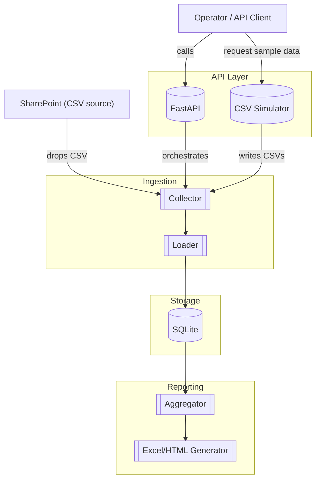

# Service Boundaries

This diagram outlines boundaries between core subsystems and external actors.

Notes:

- Each subgraph is a boundary with well-defined contracts.
- API is the sole entry point for orchestration; no direct cross-boundary calls.
- The simulator is optional and only writes CSVs that the ingestion boundary consumes.
