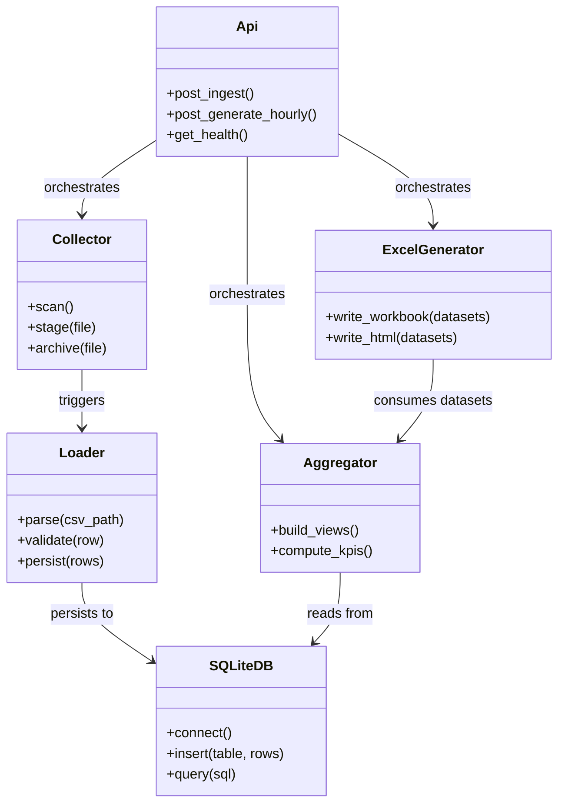

# UML Class Diagram: Foundation (conceptual)

```mermaid
classDiagram
  class Api {
    +post_ingest()
    +post_generate_hourly()
    +get_health()
  }

  class Collector {
    +scan()
    +stage(file)
    +archive(file)
  }

  class Loader {
    +parse(csv_path)
    +validate(row)
    +persist(rows)
  }

  class Aggregator {
    +build_views()
    +compute_kpis()
  }

  class ExcelGenerator {
    +write_workbook(datasets)
    +write_html(datasets)
  }

  class SQLiteDB {
    +connect()
    +insert(table, rows)
    +query(sql)
  }

  Api --> Collector : orchestrates
  Api --> Aggregator : orchestrates
  Api --> ExcelGenerator : orchestrates

  Collector --> Loader : triggers
  Loader --> SQLiteDB : persists to
  Aggregator --> SQLiteDB : reads from
  ExcelGenerator --> Aggregator : consumes datasets
```
