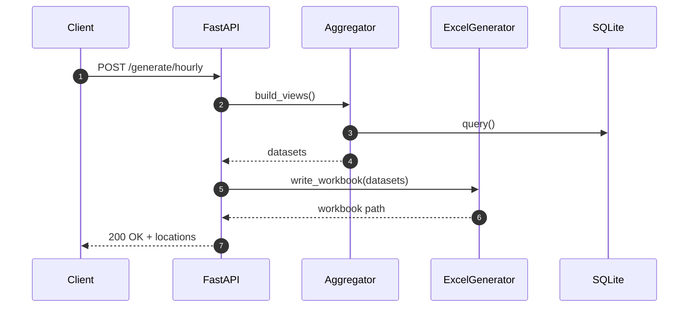

# UML Sequence Diagram: Generate Hourly Report

```mermaid
sequenceDiagram
  autonumber
  participant C as Client
  participant API as FastAPI
  participant AGG as Aggregator
  participant X as ExcelGenerator
  participant DB as SQLite

  C->>API: POST /generate/hourly
  API->>AGG: build_views()
  AGG->>DB: query()
  AGG-->>API: datasets
  API->>X: write_workbook(datasets)
  X-->>API: workbook path
  API-->>C: 200 OK + locations
```
