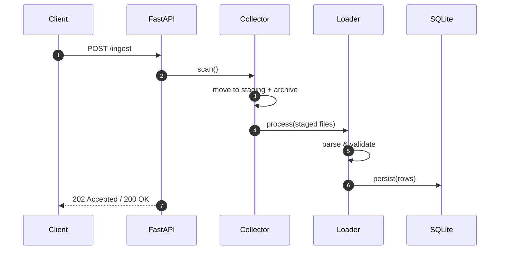

# UML Sequence Diagram: Ingest Flow

```mermaid
sequenceDiagram
  autonumber
  participant C as Client
  participant API as FastAPI
  participant COL as Collector
  participant L as Loader
  participant DB as SQLite

  C->>API: POST /ingest
  API->>COL: scan()
  COL->>COL: move to staging + archive
  COL->>L: process(staged files)
  L->>L: parse & validate
  L->>DB: persist(rows)
  API-->>C: 202 Accepted / 200 OK
```
