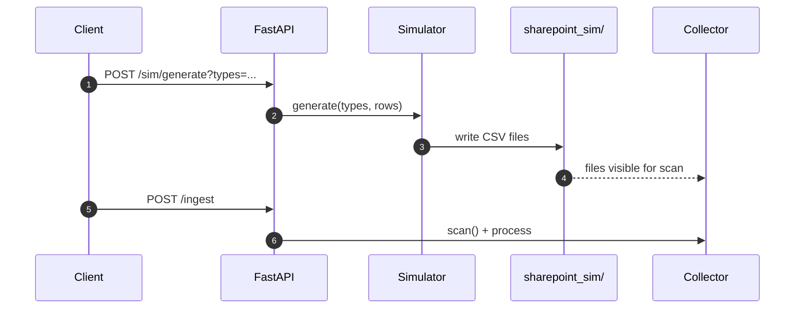

# UML Sequence Diagram: Simulator Generate

```mermaid
sequenceDiagram
  autonumber
  participant C as Client
  participant API as FastAPI
  participant SIM as Simulator
  participant FS as sharepoint_sim/
  participant COL as Collector

  C->>API: POST /sim/generate?types=...
  API->>SIM: generate(types, rows)
  SIM->>FS: write CSV files
  FS-->>COL: files visible for scan
  C->>API: POST /ingest
  API->>COL: scan() + process
```
