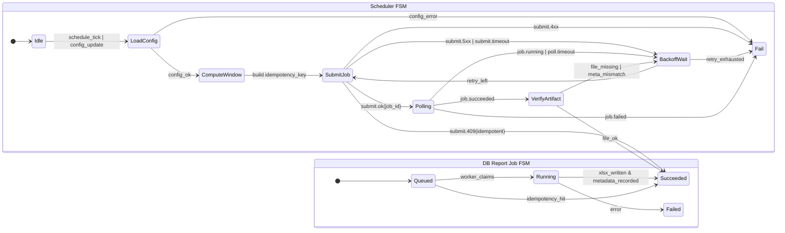
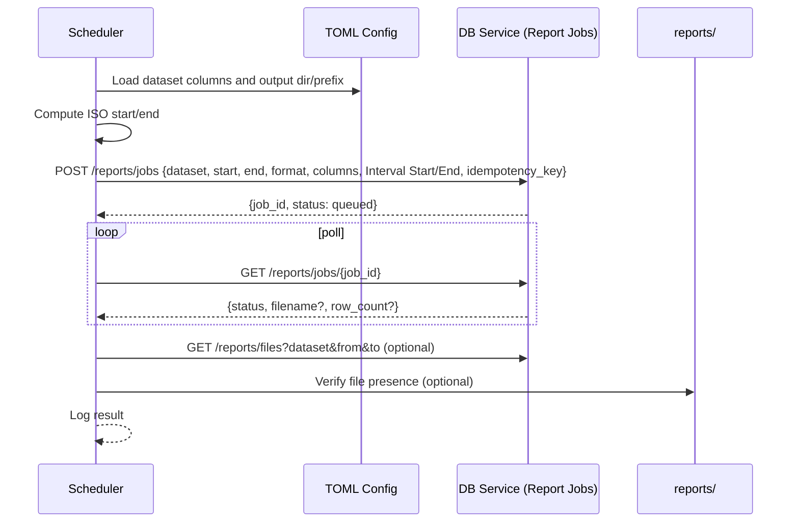

# Design Spec: Scheduler-driven Excel Report Generation

See also:

- Architecture diagrams: docs/architecture/diagrams/report-jobs-architecture.md
- API stub (OpenAPI): docs/specs/report_jobs_openapi.yaml

This document defines the requirements, interfaces, and behaviors for generating Excel (.xlsx) reports driven by the Scheduler and executed by the DB Service.

## scope and goals

- Scheduler, not end-users, initiates report generation.
- Use `config/config.toml` as the single source of truth for report columns per dataset via the `[reports]` table.
- Time filtering uses “Interval Start” and “Interval End” columns from the dataset.
- Output is .xlsx only (one sheet per dataset) for this phase.
- Assume the DB data is already clean; no deduplication logic in Scheduler/Report job path.

## functional requirements

- Configuration
  - Load report column definitions from `[reports]` in `config/config.toml`.
  - Use `[output].excel_dir` for destination folder and `[output].excel_prefix` for filenames.
  - Time columns: "Interval Start" and "Interval End" must be used for filtering.
- Scheduling & orchestration
  - Scheduler computes time windows and submits report jobs to the DB Service.
  - Scheduler polls for job completion and verifies the resulting artifact exists.
- Report generation
  - DB Service fetches rows where: Interval Start >= start_time AND Interval End <= end_time (inclusive).
  - Project and order columns exactly as defined for the dataset in `[reports]`.
  - Drop any extra columns from DB; add missing configured columns as empty.
  - Write one-sheet .xlsx with sheet name equal to dataset (<= 31 chars).
- Idempotency
  - DB Service must accept an `idempotency_key` and deduplicate submissions with identical parameters.

## non-functional requirements

- Reliability: idempotent job submission; retries with capped backoff on transient failures.
- Observability: log job creation, start, success/failure, filename, row_count, and durations.
- Performance: project only required columns; consider paging for very large datasets in future.
- Security: prevent path traversal; validate dataset and column inputs against config.

## configuration contract

- `config/config.toml`
  - `[reports]` — map of dataset name -> ordered list of exact column names.
  - `[output]` — `excel_dir` (string), `excel_prefix` (string).
  - `[general]` — informational; does not affect filtering logic for now.

Example excerpt:

```toml
[reports]
"ACQ" = ["Agent Name", "Handle"]
"Productivity" = ["Agent Name", "Logged In", "On Queue", "Idle", "Off Queue", "Interacting"]

[output]
excel_dir = "reports"
excel_prefix = "report_"
```

## db service – report jobs api

- POST /reports/jobs
  - Request body:
    - dataset: string
    - start_time: ISO 8601 string (inclusive)
    - end_time: ISO 8601 string (inclusive)
    - format: "xlsx"
    - columns: array of strings (exact order from config)
    - interval_start_column: "Interval Start"
    - interval_end_column: "Interval End"
    - idempotency_key: string (sha256 of dataset|start|end|format|columns)
  - Response: `{ job_id, status: "queued" | "succeeded" (idempotent) }`

- GET /reports/jobs/{job_id}
  - Response: `{ status: "queued"|"running"|"succeeded"|"failed", filename?, row_count?, error? }`

- GET /reports/files?dataset&start_time&end_time
  - Response: `{ files: [{ filename, dataset, generated_at, row_count }] }`

- GET /reports/download/{filename}
  - Returns file bytes with xlsx content-type.

## artifact naming

- File path: `{excel_dir}/{excel_prefix}{dataset}_{YYYYMMDDTHHMMSS}.xlsx`
- Sheet name: `{dataset}` truncated to 31 characters.

## fsm (scheduler + db service)



## sequence diagram



## uml (logical)

```mermaid
classDiagram
  class Scheduler {
    +loadConfig(): Config
    +computeWindow(job): (start,end)
    +submitJob(req): JobId
    +pollUntilComplete(jobId): JobStatus
    +verifyArtifact(JobStatus): bool
  }
  class ReportJobRequest {
    +dataset: str
    +start_time: str
    +end_time: str
    +format: str
    +columns: List~str~
    +interval_start_column: str
    +interval_end_column: str
    +idempotency_key: str
  }
  class DBReportJobsAPI {
    +createJob(ReportJobRequest): JobId
    +getJobStatus(JobId): JobStatus
    +listFiles(filter): List~ReportFile~
    +download(filename): bytes
  }
  class ReportWorker {
    +execute(jobId)
    -fetchRows(req): List~dict~
    -shape(rows, columns): DataFrame
    -writeXlsx(df, path): Path
  }
  class Config {
    +reports: Map~dataset, List~columns~~
    +output: {excel_dir, excel_prefix}
  }
  Scheduler --> DBReportJobsAPI
  Scheduler --> Config
  DBReportJobsAPI --> ReportWorker
  ReportWorker --> Config
```

## test plan (design)

- Config parsing: exact ordered columns per dataset; unknown dataset → validation error.
- Interval filtering: include rows where Interval Start ≥ start_time AND Interval End ≤ end_time; empty window yields header-only xlsx.
- Column shaping: keep configured columns in order; missing columns appear empty.
- File emission: correct filename pattern and sheet name length.
- Idempotency: repeat submissions return existing job/artifact without duplicates.
- Scheduler orchestration: correct request composition and polling behavior with backoff.

## assumptions & open items

- Default timezone is UTC; inputs are ISO strings. If needed, add `timezone` in config later.
- If any dataset uses different time column names, add overrides under a future `[datasets.<name>]` section.
- Retention/cleanup policy for reports is future work.
