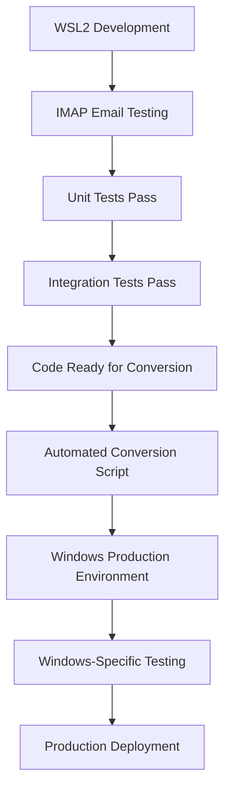

# Integration Test Suite

Complete integration test suite for the charlie-reporting system that tests real email sending/receiving, SMTP authentication, data generation, and email attachment workflows.

## 🚨 **Development Platform Considerations**

### **Recommended Development Approach**

Given the common Windows development challenges (especially for Linux developers), here are the recommended approaches:

#### **Option 1: WSL2 Development (Recommended for Linux Developers)**
```bash
# Advantages:
✅ Familiar Linux environment and tools
✅ Better Python package compatibility
✅ Consistent behavior with production Linux servers
✅ Superior debugging and development experience
✅ Faster package installation and dependency management

# Challenges:
❌ Cannot use Windows Outlook COM interface directly
❌ Requires alternative email verification approach
❌ Some conversion needed for Windows production deployment
```

#### **Option 2: Native Windows Development**
```powershell
# Advantages:
✅ Direct Outlook COM interface access
✅ No conversion needed for Windows production
✅ Windows-specific features work natively

# Challenges:
❌ Python package installation issues (especially C extensions)
❌ Path handling complexity (backslashes vs forward slashes)
❌ Environment variable syntax differences
❌ Different process and file handling behavior
❌ PowerShell vs Bash command differences
```

### **Hybrid Approach Solution**

**Best Strategy**: Develop in WSL2 + Use email alternatives for testing:

1. **Primary Development**: WSL2 for all Python development
2. **Email Testing**: Use IMAP/Exchange Web Services instead of COM
3. **Production Deployment**: Simple conversion process
4. **Windows-Specific Testing**: Run final integration tests on Windows

## Platform-Specific Setup

This integration test suite provides comprehensive testing of:

- **SMTP Email Operations**: Real email sending with authentication
- **Email Receipt Verification**: Outlook integration for email checking
- **CSV Data Generation**: Dynamic test data creation
- **File Attachment Workflows**: Email attachments with CSV files
- **Directory Scanning**: File processing simulation
- **Error Handling**: Graceful failure scenarios
- **Performance Testing**: Timeout and timing validation
- **End-to-End Workflows**: Complete system integration

## Platform-Specific Setup

### **🐧 WSL2 Development Setup (Recommended for Linux Developers)**

```bash
# 1. Install Python and dependencies
sudo apt update
sudo apt install python3.11 python3.11-venv python3-pip

# 2. Create and activate virtual environment
python3.11 -m venv .venv
source .venv/bin/activate

# 3. Install Python packages
pip install --upgrade pip
pip install pandas toml python-dotenv

# 4. Install email libraries (IMAP instead of COM)
pip install imaplib2 exchangelib

# 5. Set environment variables (Linux style)
export INTEGRATION_TEST_EMAIL_PASSWORD="your_password"
export INTEGRATION_TEST_APP_PASSWORD="your_app_password"
export INTEGRATION_TESTS_ENABLED="true"

# 6. WSL2-specific email configuration
# Use IMAP instead of Outlook COM for email verification
```

### **🪟 Windows Native Development Setup**

```powershell
# 1. Ensure Python 3.7+ is installed
python --version

# 2. Create virtual environment
python -m venv .venv
.venv\Scripts\Activate.ps1

# 3. Install packages (may require admin for some packages)
pip install --upgrade pip
pip install pandas toml pywin32

# 4. Set environment variables (PowerShell)
$env:INTEGRATION_TEST_EMAIL_PASSWORD = "your_password"
$env:INTEGRATION_TEST_APP_PASSWORD = "your_app_password"
$env:INTEGRATION_TESTS_ENABLED = "true"

# 5. Windows-specific considerations
# - Ensure Outlook is installed and configured
# - Run as Administrator if COM registration issues occur
# - May need Visual C++ Build Tools for some packages
```

### **📧 Email Verification Alternatives**

Since WSL2 cannot access Windows Outlook COM, here are cross-platform alternatives:

#### **IMAP Email Verification (Recommended for WSL2)**
```python
import imaplib
import email

def verify_email_imap(server, username, password, subject_filter):
    """Cross-platform email verification using IMAP"""
    mail = imaplib.IMAP4_SSL(server)
    mail.login(username, password)
    mail.select('inbox')
    
    typ, data = mail.search(None, f'SUBJECT "{subject_filter}"')
    return len(data[0].split()) > 0
```

#### **Exchange Web Services (Office 365)**
```python
from exchangelib import Credentials, Account

def verify_email_exchange(username, password, subject_filter):
    """Office 365/Exchange email verification"""
    credentials = Credentials(username, password)
    account = Account(username, credentials=credentials, autodiscover=True)
    
    for item in account.inbox.filter(subject__contains=subject_filter):
        return True
    return False
```

## Safety Features

- **Disabled by Default**: Integration tests are disabled until explicitly enabled
- **Environment Variables**: Secure credential management via environment variables
- **Automatic Cleanup**: Comprehensive cleanup of test emails and temporary files
- **Unique Test IDs**: Each test run uses unique identifiers to avoid conflicts
- **Validation Checks**: Prerequisites verification before test execution

## Quick Start

### 1. Environment Setup

Set required environment variables:

```powershell
# Email authentication
$env:INTEGRATION_TEST_EMAIL_PASSWORD = "your_email_password"
$env:INTEGRATION_TEST_APP_PASSWORD = "your_app_specific_password"

# Enable integration tests
$env:INTEGRATION_TESTS_ENABLED = "true"
```

### 2. Enable Integration Tests

Edit `tests/config/integration-config.toml`:

```toml
[integration_tests]
enabled = true  # Change from false to true
```

### 3. Run Tests

```powershell
# Navigate to tests directory
cd tests

# Run integration test suite
python run_integration_tests.py
```

## Configuration

### Integration Config File

The integration tests use `tests/config/integration-config.toml` for configuration:

```toml
[integration_tests]
enabled = false  # Safety: disabled by default
default_timeout_seconds = 60
cleanup_test_emails = true

[email]
test_sender_address = "your_test_sender@gmail.com"
test_receiver_address = "your_test_receiver@outlook.com"

[smtp]
server = "smtp.gmail.com"
port = 587
use_tls = true

[outlook]
test_account = "your_test_receiver@outlook.com"
```

### Environment Variable Overrides

Configuration can be overridden with environment variables:

```powershell
# Email configuration
$env:INTEGRATION_TEST_SENDER_EMAIL = "custom_sender@domain.com"
$env:INTEGRATION_TEST_RECEIVER_EMAIL = "custom_receiver@domain.com"

# SMTP configuration
$env:INTEGRATION_TEST_SMTP_SERVER = "smtp.office365.com"
$env:INTEGRATION_TEST_SMTP_PORT = "587"

# Test control
$env:INTEGRATION_TESTS_ENABLED = "true"
$env:INTEGRATION_TEST_TIMEOUT = "120"
```

## Test Suite Details

### Test Categories

1. **test_01_smtp_connection_and_basic_email**
   - Verifies SMTP connection and basic email sending
   - Tests email receipt verification
   - Validates email content

2. **test_02_csv_data_generation**
   - Tests CSV file generation with various configurations
   - Verifies CSV structure and content
   - Validates multiple file generation

3. **test_03_email_with_csv_attachments**
   - Tests email sending with CSV attachments
   - Verifies attachment receipt and integrity
   - Validates attachment metadata

4. **test_04_multiple_csv_email_workflow**
   - Tests batch email sending with multiple CSVs
   - Verifies sequential email processing
   - Validates workflow timing

5. **test_05_directory_scanning_simulation**
   - Simulates directory scanning and file processing
   - Tests file archiving workflows
   - Validates directory management

6. **test_06_error_handling_and_recovery**
   - Tests error scenarios (invalid emails, missing files)
   - Verifies graceful failure handling
   - Validates error recovery mechanisms

7. **test_07_performance_and_timeout_handling**
   - Tests performance characteristics
   - Validates timeout handling
   - Measures processing times

8. **test_08_end_to_end_complete_workflow**
   - Complete system integration test
   - Tests full workflow from data generation to email delivery
   - Validates all components working together

### Utility Components

- **IntegrationEmailManager**: SMTP email operations with Gmail support
- **OutlookChecker**: Email verification and cleanup via Outlook COM
- **IntegrationDataGenerator**: Dynamic CSV test data generation
- **IntegrationTempManager**: Temporary file and directory management
- **IntegrationTestBase**: Base class with safety checks and cleanup

## Prerequisites

### Software Requirements

- Python 3.7+
- Microsoft Outlook (for email verification)
- Required Python packages:
  - `win32com` (pywin32)
  - `pandas`
  - `toml`
  - Standard library modules

### Email Account Setup

#### Gmail SMTP (Sender)
1. Enable 2-factor authentication
2. Generate app-specific password
3. Use app password in `INTEGRATION_TEST_EMAIL_PASSWORD`

#### Outlook Account (Receiver)
1. Ensure Outlook is installed and configured
2. Account should be accessible via COM interface
3. Configure in `integration-config.toml`

### Network Requirements

- Outbound SMTP access (port 587 for Gmail)
- Internet connectivity for email operations
- Windows environment (for Outlook COM interface)

## Safety and Security

### Security Best Practices

- **Never commit credentials** to version control
- Use environment variables for all sensitive data
- Enable integration tests only when needed
- Use dedicated test email accounts

### Cleanup Mechanisms

- Automatic deletion of test emails by subject pattern
- Comprehensive temporary file cleanup
- Directory structure restoration
- Error state recovery

### Safety Checks

- Prerequisites verification before test execution
- Configuration validation
- Environment variable validation
- Graceful failure handling

## Troubleshooting

### Common Issues

1. **"Integration tests are disabled"**
   - Solution: Set `enabled = true` in config or set `INTEGRATION_TESTS_ENABLED=true`

2. **"Missing required environment variables"**
   - Solution: Set email passwords in environment variables

3. **"SMTP connection failed"**
   - Check email credentials and app passwords
   - Verify network connectivity
   - Confirm SMTP server settings

4. **"Outlook not available"**
   - Ensure Outlook is installed and running
   - Check COM interface accessibility
   - Verify account configuration

### Debug Mode

Enable debug logging by modifying log level in test runner:

```python
# In run_integration_tests.py
console_handler.setLevel(logging.DEBUG)  # Change from INFO to DEBUG
```

### Log Files

Integration test logs are saved to:
- `logs/integration_test_run_YYYYMMDD_HHMMSS.log`

## WSL2 → Windows Production Conversion Guide

### **Easy Conversions (Automatic)**

These elements require **no changes** when moving from WSL2 to Windows:

```python
✅ Python source code (identical)
✅ TOML configuration files
✅ SMTP email sending logic
✅ CSV processing and data generation
✅ File I/O operations (using pathlib)
✅ Virtual environment structure
✅ Requirements.txt dependencies
```

### **Simple Conversions (Scripted)**

```bash
# 1. Environment Variables
# WSL2/Linux:
export VARIABLE_NAME="value"

# Windows PowerShell:
$env:VARIABLE_NAME = "value"

# 2. Path Separators (handled automatically by pathlib)
# WSL2/Linux:
Path("/home/user/project/file.txt")

# Windows:
Path("C:\\Users\\user\\project\\file.txt")
# Both work with: Path.cwd() / "project" / "file.txt"

# 3. Virtual Environment Activation
# WSL2/Linux:
source .venv/bin/activate

# Windows:
.venv\Scripts\Activate.ps1
```

### **Platform-Specific Adaptations**

#### **Email Verification Component**
```python
# Development (WSL2) - IMAP approach
class LinuxEmailChecker:
    def __init__(self, imap_server, username, password):
        self.server = imap_server
        self.username = username
        self.password = password
    
    def verify_email(self, subject_filter):
        # IMAP implementation

# Production (Windows) - COM approach  
class WindowsEmailChecker:
    def __init__(self):
        import win32com.client
        self.outlook = win32com.client.Dispatch("Outlook.Application")
    
    def verify_email(self, subject_filter):
        # COM implementation
```

#### **Deployment Script**
```python
# automated_conversion.py
import platform
import shutil
from pathlib import Path

def convert_for_windows():
    """Convert WSL2 development to Windows production"""
    
    # 1. Copy source files (no changes needed)
    shutil.copytree("src/", "windows_deployment/src/")
    
    # 2. Update email checker to use Windows COM
    update_email_verification_component()
    
    # 3. Convert environment files
    convert_env_files()
    
    # 4. Create Windows-specific scripts
    create_windows_scripts()
    
    print("✅ Conversion complete!")
```

### **Recommended Development Workflow**



### **Conversion Checklist**

```bash
# Pre-conversion checklist:
□ All tests pass in WSL2 environment
□ Code uses pathlib for all file operations
□ Environment variables properly documented
□ Email verification logic isolated in separate module
□ Configuration files use relative paths
□ Dependencies documented in requirements.txt

# Post-conversion verification:
□ Virtual environment recreated on Windows
□ All dependencies installed successfully
□ Environment variables set correctly
□ Outlook COM interface working
□ Integration tests pass on Windows
□ File paths resolve correctly
□ Email sending/receiving functional
```

## Development Platform Recommendation

**For your situation (Linux developer, Windows production):**

🎯 **Use WSL2 for development** with these strategies:

1. **Primary Development**: WSL2 + IMAP email verification
2. **Cross-Platform Code**: Use pathlib, avoid platform-specific code
3. **Isolated Email Logic**: Separate email verification into platform-specific modules
4. **Automated Conversion**: Script the WSL2 → Windows conversion process
5. **Final Testing**: Test converted code on native Windows before production

**Benefits of this approach:**
- ✅ Comfortable Linux development environment
- ✅ Faster development and debugging
- ✅ Better package compatibility
- ✅ Minimal conversion effort (mostly just email verification)
- ✅ Production Windows compatibility verified through testing

## Development

### Adding New Tests

1. Create test method in `TestCompleteIntegration` class
2. Use `IntegrationTestBase` utilities for common operations
3. Follow naming convention: `test_##_descriptive_name`
4. Include comprehensive logging and assertions

### Extending Utilities

1. Add methods to existing utility classes
2. Follow error handling patterns
3. Include comprehensive logging
4. Add configuration support as needed

### Configuration Changes

1. Update `integration-config.toml` for new settings
2. Add environment variable overrides in `EnhancedConfigLoader`
3. Update documentation and examples

## Support

For issues or questions regarding the integration test suite:

1. Check logs for detailed error information
2. Verify prerequisites and configuration
3. Review this documentation
4. Contact development team

---

**Author**: Jonathan Wardwell, Copilot, GPT-4o  
**License**: MIT  
**Last Updated**: 2024
